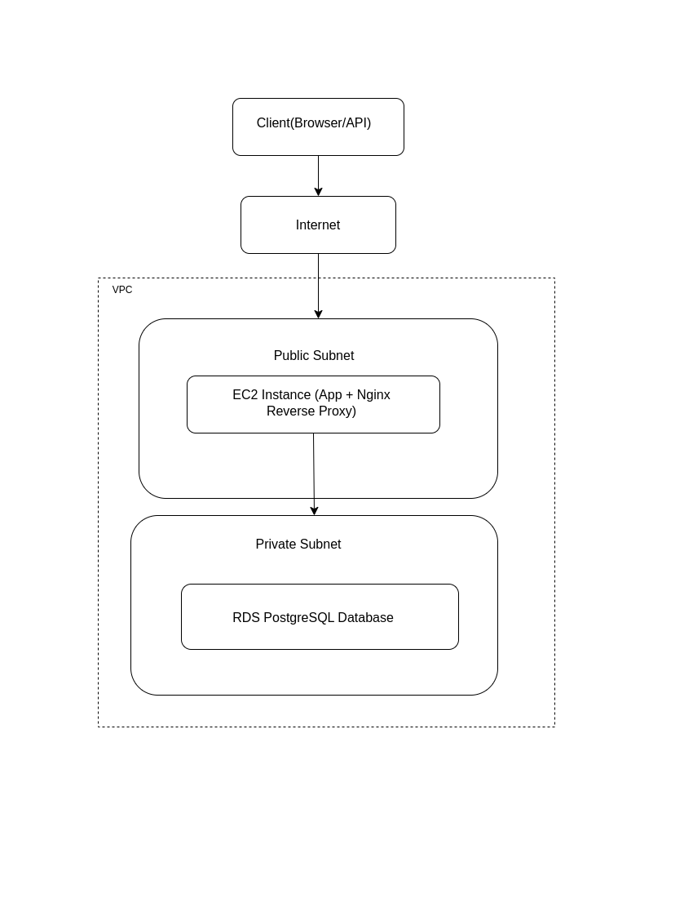

# M-PESA Africa DevOps Assessment

## Overview
This project demonstrates how a simple application can be containerized, configured, and prepared for production using DevOps best practices.  

The focus is not the application logic, but:
- Containerization (Docker)
- Local orchestration (Docker Compose)
- CI/CD pipeline design
- Infrastructure planning (IaC-ready)

---
# TASK 1:

## Application

A minimal FastAPI application with two endpoints:

- `GET /health` → Health check endpoint  
- `GET /payments` → Sample payments endpoint  
- `POST /payments` → Simulated payment creation  

---

## Running Locally

### Prerequisites
- Docker
- Docker Compose

### Run the application

```bash
docker compose up --build
```
## Project Structure

mpesa-devops-Test/
│
├── app/
│   ├── main.py
│   ├── requirements.txt
│
├── Dockerfile
├──docker-compose.yml
│
├── terraform/
│   ├── main.tf
│   ├── variables.tf
│   ├── outputs.tf
│   ├── provider.tf
│
├── .github/
│   └── workflows/
│       └── ci.yml
│
├── nginx/
│   └── default.conf
│
├── .env
├── README.MD

Access endpoints
http://localhost/health
http://localhost/payments
http://localhost/docs
```
### Architecture

The application is composed of three services:

1. FastAPI App

- Handles API requests
- Runs on port 8000

2. PostgreSQL Database

- Stores application data
- Runs in a separate container

3. Nginx Reverse Proxy

- Routes incoming traffic to the app
- Exposes port 80

* Request Flow:
```
Client → Nginx →  App(FastAPI) → PostgreSQL
```

### Docker Design
- Multi-stage Docker build used to reduce final image size
- Uses python:3.12-slim for minimal footprint
- Dependencies installed in a builder stage
- No secrets hardcoded — environment variables used for configuration.


# TASK 2:

### CI/CD Pipeline

Implemented using GitHub Actions.

* Pipeline Stages:

1. Lint & Test
- Runs on every push and pull request
- Ensures code quality using flake8

2. Build Docker Image
- Builds container image

* Tagging Strategy
- Tags image using Unique tag: Commit SHA (${{ github.sha }}) for traceability
- Also tagged as latest

3. Push to Registry
- Configured to push to container registry (placeholder)

4. Manual Approval Gate
- Required before production deployment
- Prevents accidental releases

5. Deployment
- Simulated deployment step

6.  Rollback Strategy
- Previous image tag is redeployed in case of failure
- Enables recovery in under 5 minutes

##  Secrets Management
No secrets are hardcoded in the codebase
Environment variables are used via .env

Designed to integrate with:
- AWS Secrets Manager
- Azure Key Vault

# TASK 3:
## Infrastructure as Code (Terraform)

The system is designed to run on cloud infrastructure using Terraform.

Planned components:

- Virtual Private Cloud (VPC)
- Public and private subnets
- Compute service (ECS/EC2) for application hosting
- Managed database (RDS)
- IAM roles with least privilege
- External secrets management

## An architecture diagram showing how all components connect

#### M-PESA DevOps Architecture



### Key Notes
- Nginx acts as a reverse proxy to route incoming traffic
- Application runs in a public subnet for accessibility
- Database is isolated in a private subnet for security
- Architecture supports scalability and separation of concerns

### Design Considerations
- Database is isolated in a private subnet for security
- Secrets are not hardcoded and would be managed using AWS Secrets Manager in production

## Production Considerations
- Stateless application design
- Reverse proxy for traffic routing
- Ready for horizontal scaling
- Health check endpoint for monitoring
- Clear separation of concerns (app, DB, proxy)

### Assumptions
- Application is a simplified prototype
- Database is not fully integrated into app logic
- CI/CD pipeline uses placeholder registry credentials
- Deployment step is simulated

### Improvements (With More Time)
- Add unit and integration tests
- Implement real database interactions
- Add monitoring (Prometheus + Grafana)
- Add centralized logging
- Use Kubernetes for orchestration
- Implement blue-green or rolling deployments
- Secure secrets using a cloud secrets manager

### Key Design Decisions
- Chose FastAPI for simplicity and speed of development
- Used Docker Compose to simulate production-like environment locally
- Prioritized simplicity due to small team constraint
- Focused on reliability, rollback, and maintainability over complexity

### Summary

This project demonstrates:

- Practical DevOps workflow design
- Secure configuration practices
- Scalable architecture thinking
- CI/CD pipeline structure with rollback capability


